##[LAB1]
------------------------------------------------
#part 1
--------
##q1 -  
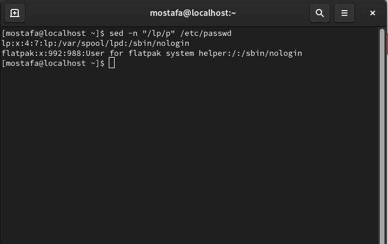 
----------
##q2 -  
 
--------
##q3 -  
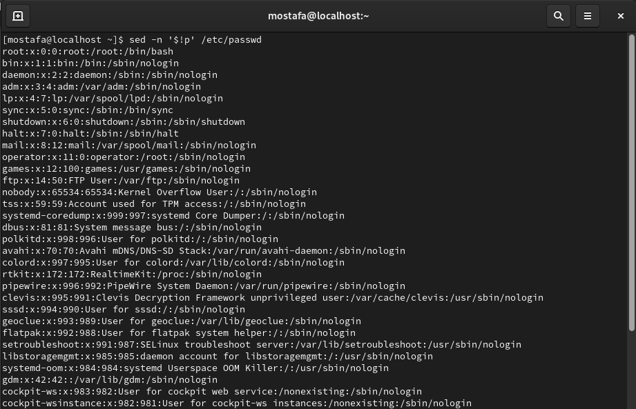 
--------
##q4 -  
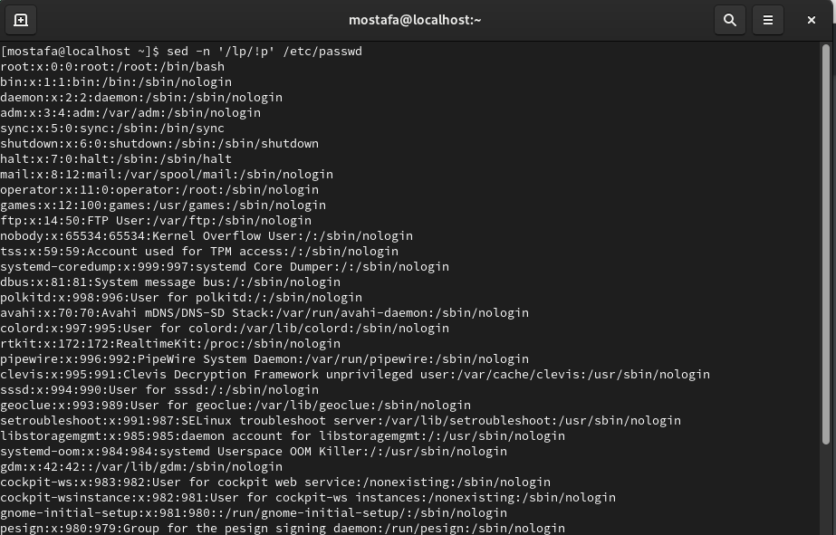 
--------
##q5 -  
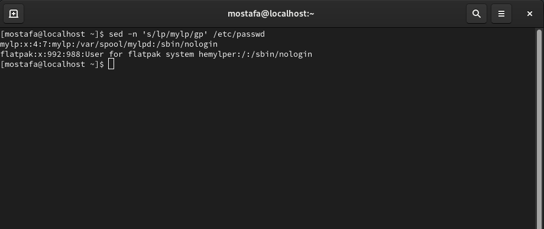 
---------------------------------------------------
#part 2
----------
##q1 -  
 
----------
##q2 -  
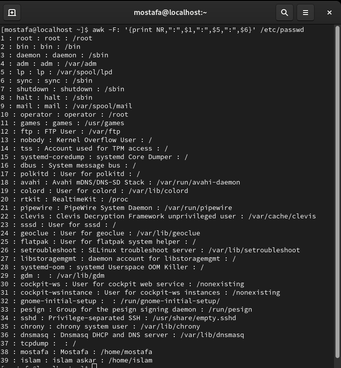 
----------
##q3 -  
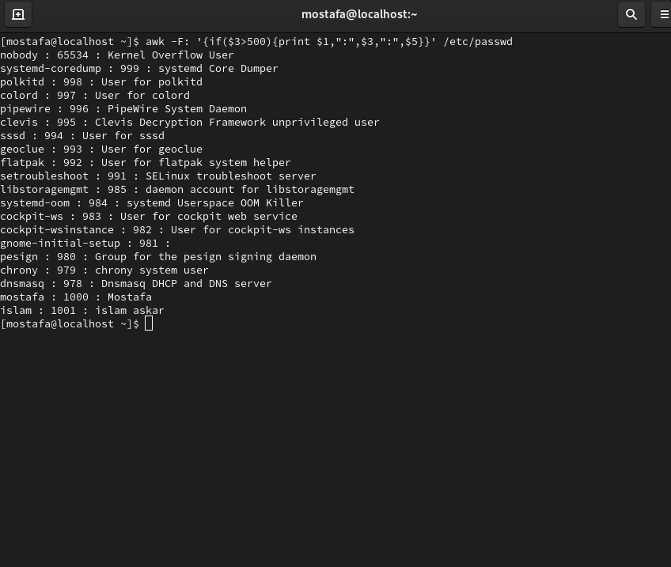 
----------
##q4 -  
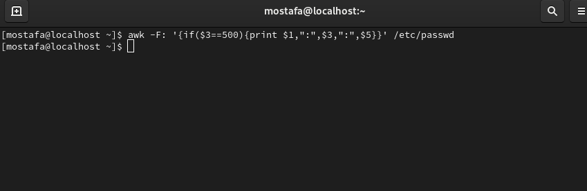 
----------
##q5 -  
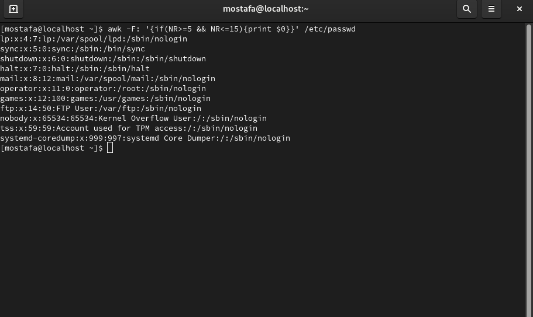 
----------
##q6 -  
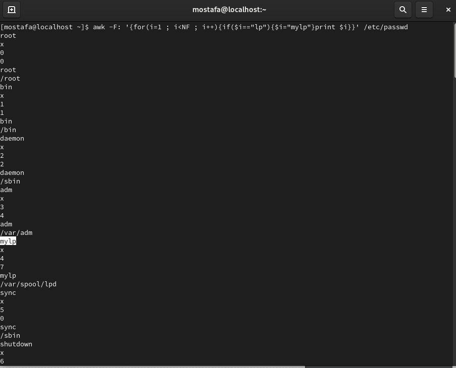 
----------
##q7 -  
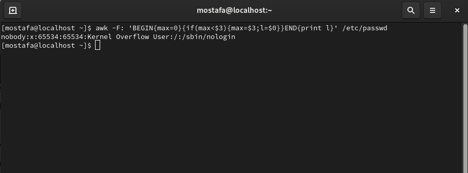 
----------
##q8 -  
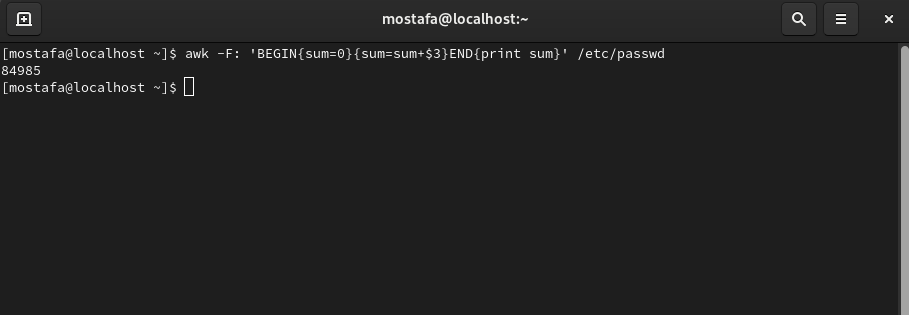 
----------

