#[LAB 3] 
------------------------------
##Q1 -  
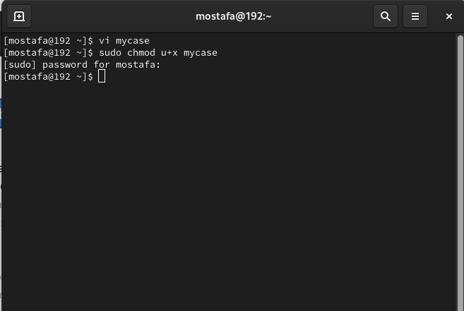
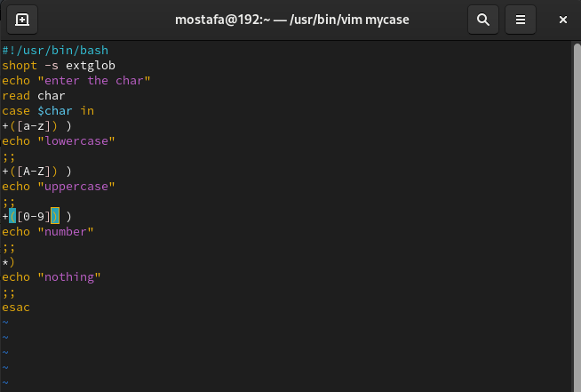
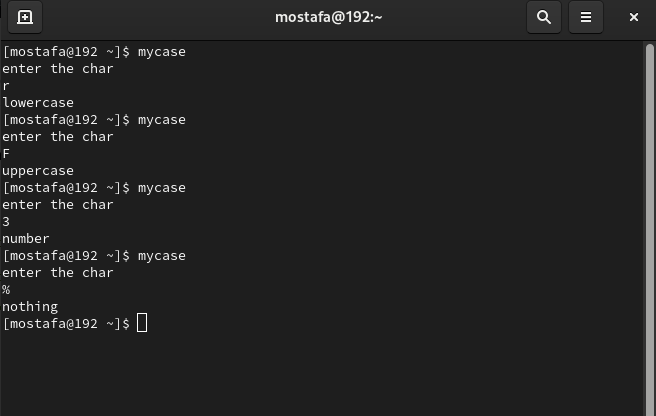
--------------------------------------------------------
##Q2 -  
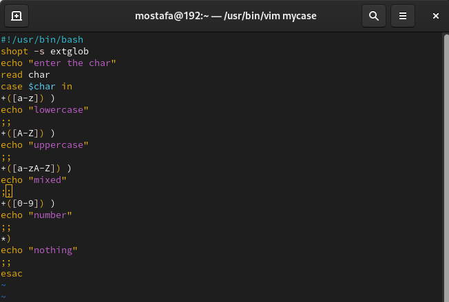
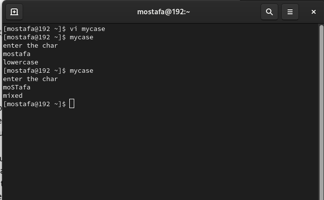
---------------------------------------------------------
##Q3 -  
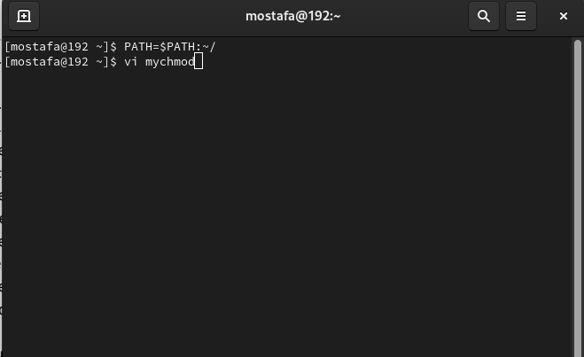
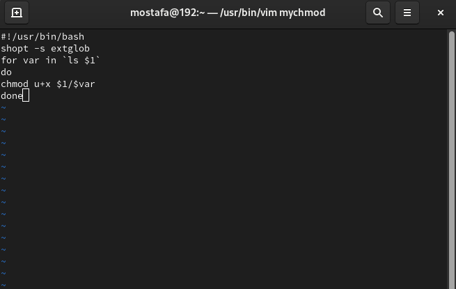
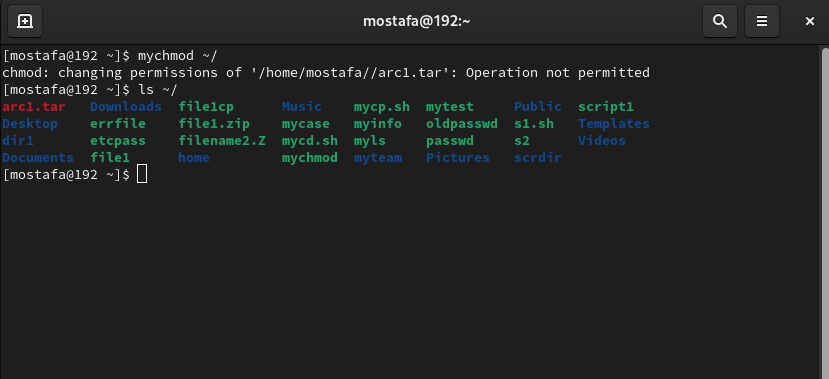
---------------------------------------------------------
##Q4 -  
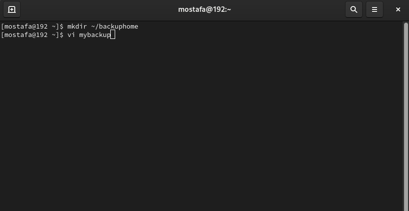
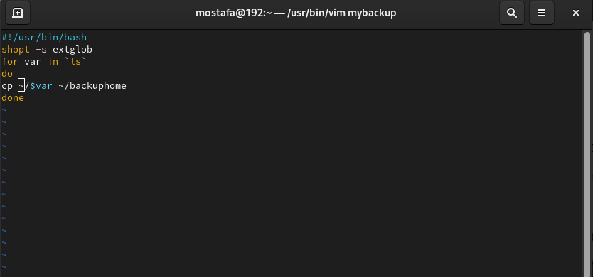
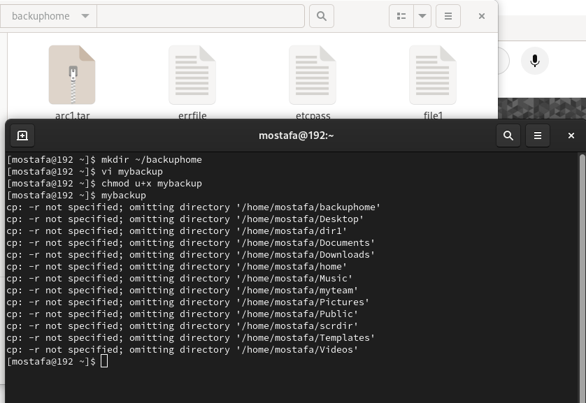
-----------------------------------------------------------
##Q5 -  
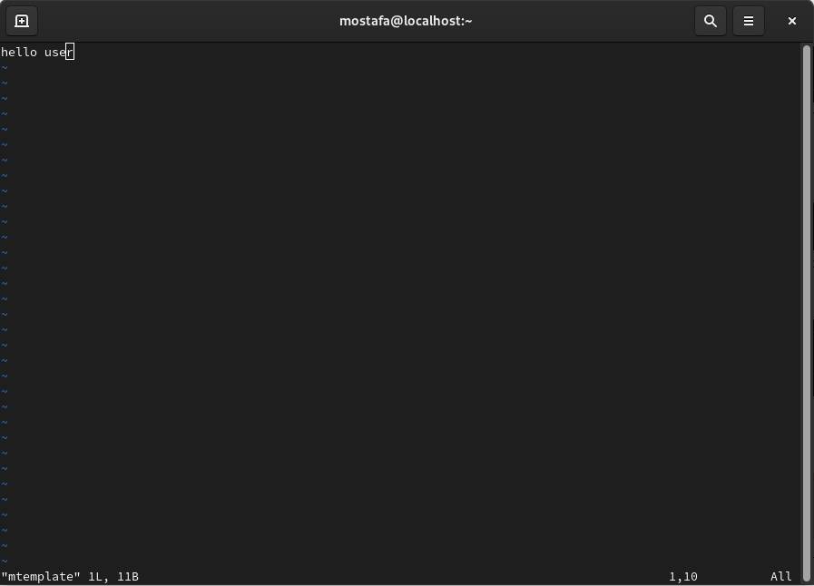
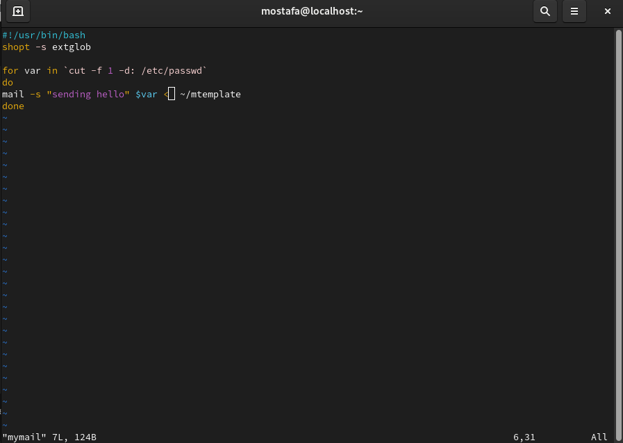
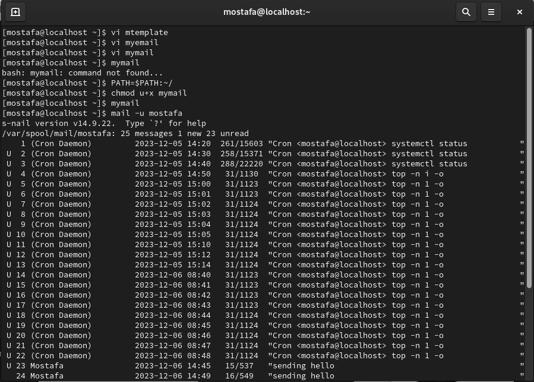
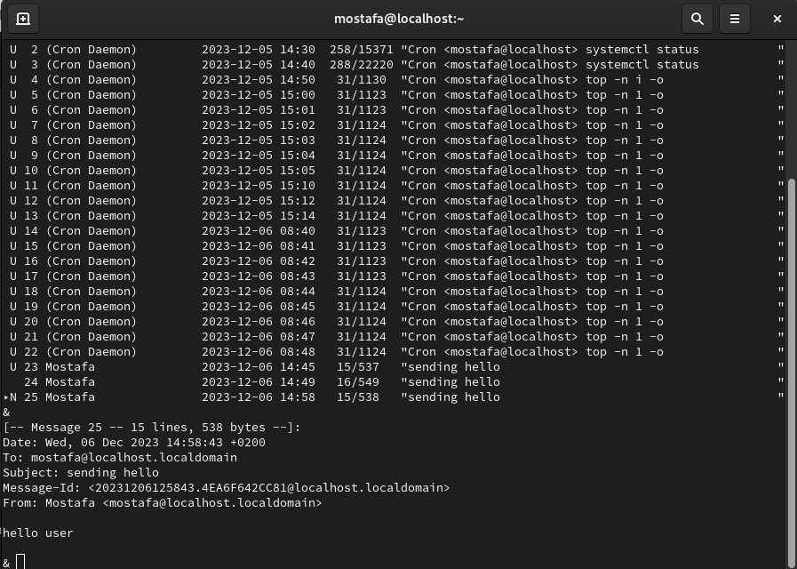
----------------------------------------------------------
##Q8 -  

----------------------------------------------------------
##Q9 -  
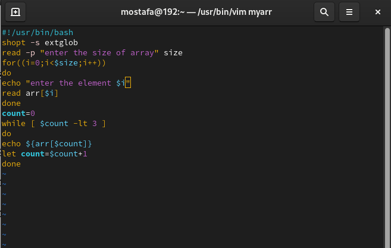
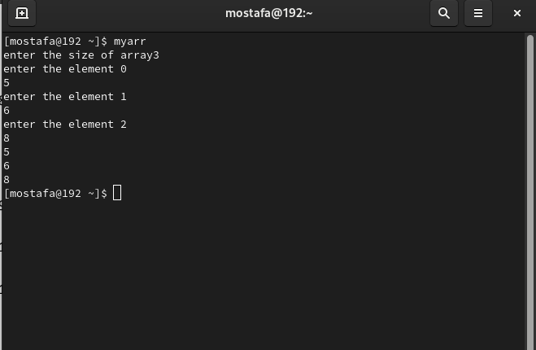
-----------------------------------------------------
##Q10 -  

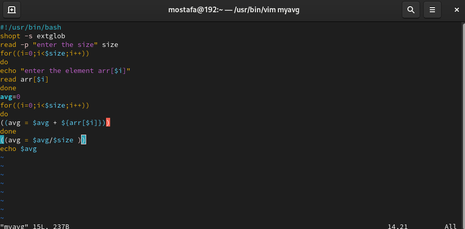
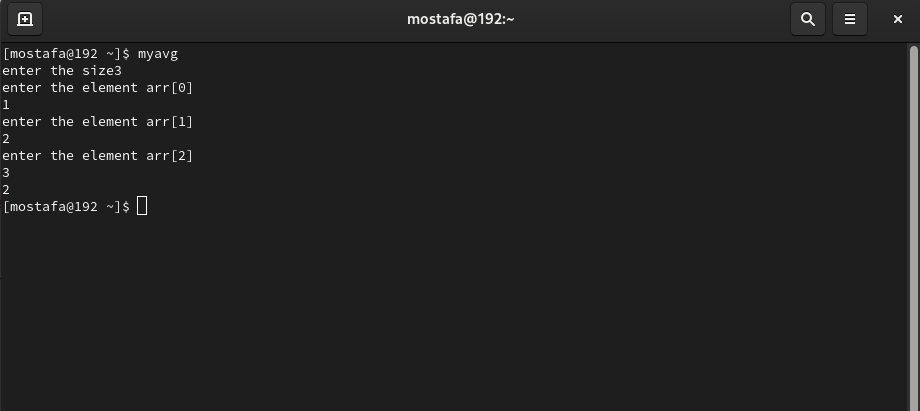
--------------------------------------------------------
##Q11 -  
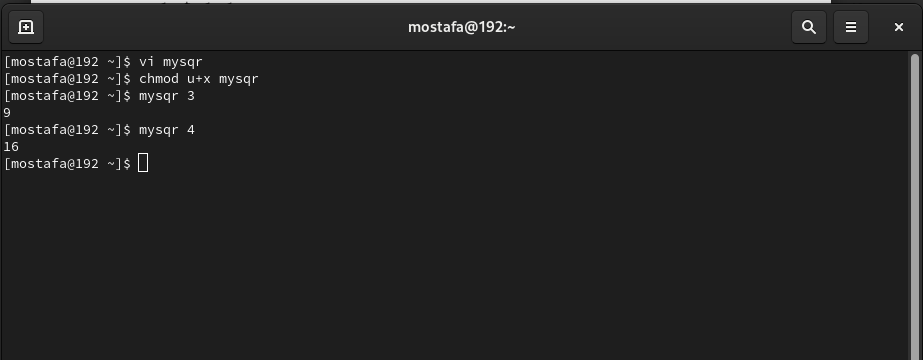
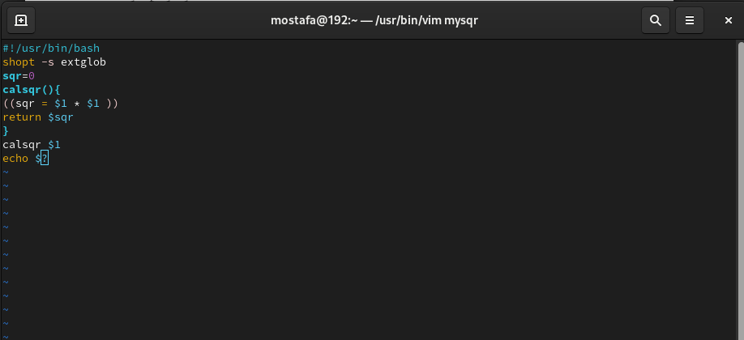
--------------------------------------------------------

